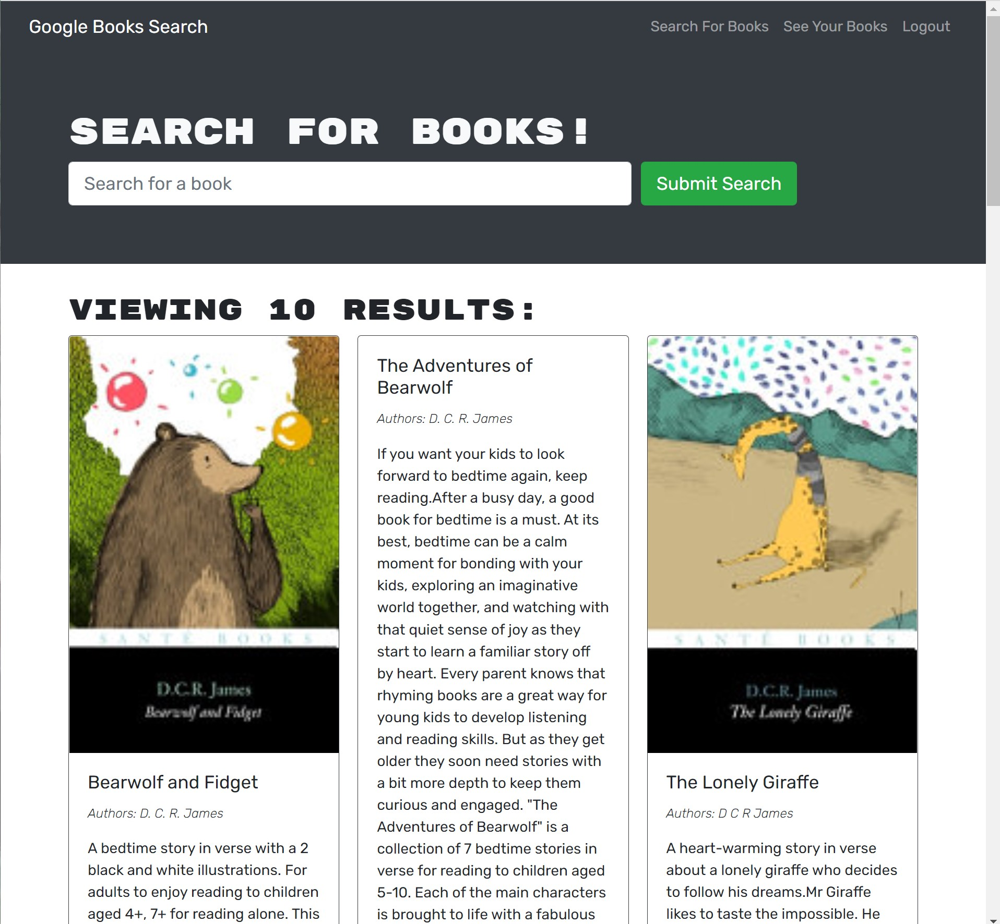
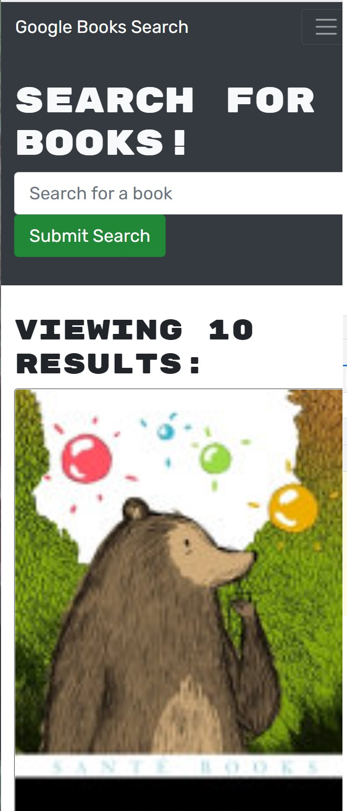

# Book Search Engine

## This is a web application for users to search google books and save a book list. The app is located on Heroku at [https://google-book-search-gdw.herokuapp.com/].

## Table of Contents:

- [Installation](#installation)
- [Usage](#usage)
- [Screenshots](#screenshots)
- [License](#license)
- [Collaborators](#collaborators)
- [Contributing](#contributing)
- [Testing](#tests)
- [Questions](#questions)

## Installation

Clone the repository from [GitHub](https://github.com/willig0203/solid-broccoli) onto your machine in a local folder if you want to run it locally.

## Usage

Step 1: From the terminal in vsCode root directory type `npm run install`,
Step 2: Enter `npm run develop` to start the client and the server,
Step 3: The web page should appear in your browser.
OR

Use the live app on Heroku: [https://google-book-search-gdw.herokuapp.com/](https://google-book-search-gdw.herokuapp.com/)

## Screenshots

|            <b>Image running on a computer</b>            |
| :------------------------------------------------------: |
|  |

|              <b>Image running on a mobile</b>               |
| :---------------------------------------------------------: |
|  |

## License

&copy; 2022 by Gary Williams (Trademark GarywareLLC).
This project is licensed under the MIT license.
https://opensource.org/licenses/MIT

## Collaborators:

Gary Williams

## Contributing

None at this time.

## Tests

None at this time.

## Questions

Contact Gary Williams at: [willig0203@gmail.com](mailto:willig0203@gmail.com)
